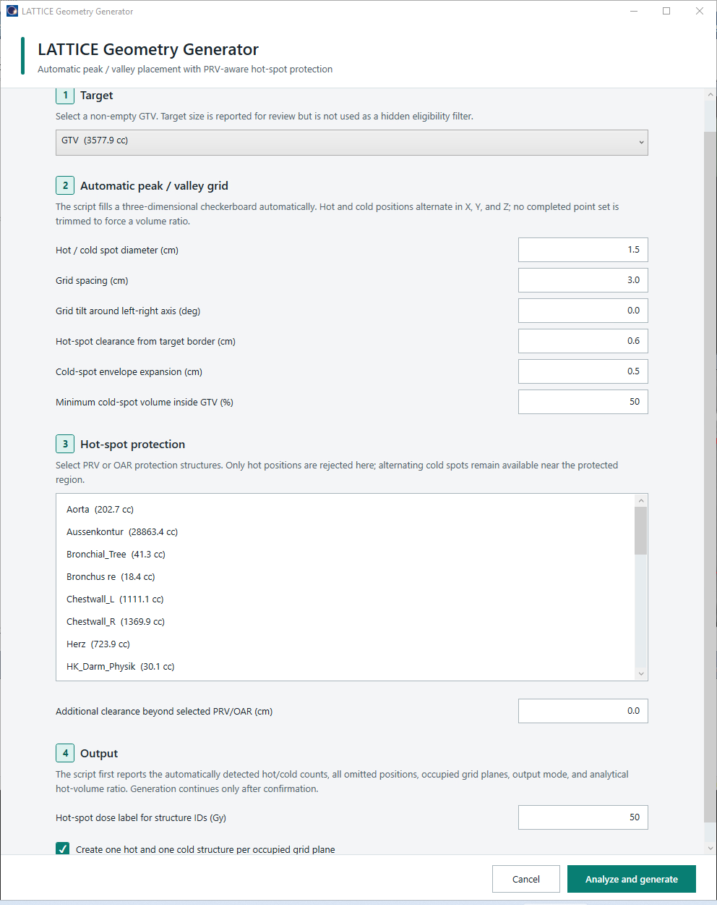
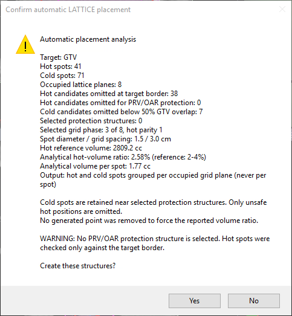
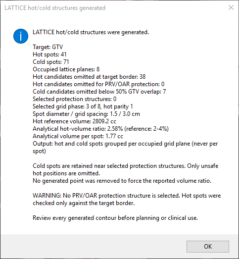
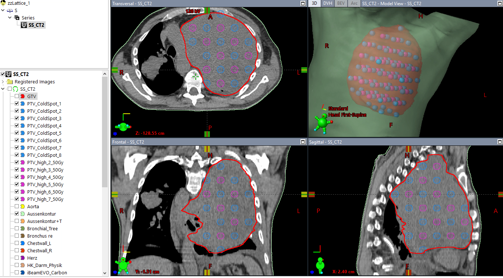

# ESAPI_LatticeHelper

An English, write-enabled Eclipse ESAPI plug-in for automatically generating
three-dimensional LATTICE hot- and cold-spot helper structures.

## Purpose

This write-enabled ESAPI plug-in creates an automatic three-dimensional LATTICE
checkerboard inside and around a selected GTV:

- **Hot spots / peaks** are placed only in the protected inner target region.
- **Cold spots / valleys** occupy the alternating grid positions in the broader
  low-dose envelope.
- Unsafe hot positions near the target border or selected PRV/OAR protection
  regions are omitted.
- Cold positions are deliberately retained near protection regions.

The program calculates how many hot and cold spots fit from the target geometry,
spot diameter, grid spacing, border clearance, cold-envelope expansion, and
selected protection structures. Cold spots must also meet the configured minimum
estimated GTV overlap. The program does not ask for a spot count and does not
delete completed points to force a volume ratio.

The tool creates structures only. It does not prescribe dose, create a treatment
plan, optimize, assess deliverability, or establish clinical suitability.

## Screenshots

### Configuration



### Placement review and completion





### Generated hot/cold geometry



## Reference Geometry

The development reference geometry contained:

- 31 hot spots
- 62 cold spots
- 7 occupied lattice planes
- approximately 1.5 cm spot diameter
- 3.0 cm adjacent grid spacing
- approximately 2% analytical hot-spot volume relative to
  `GTV-0.6cm_25Gy`

These observations provide implementation context, not a commissioned clinical
standard. The development DICOM dataset and institutional presentation are not
distributed with this repository.

## Automatic Placement Logic

### 1. Indexed three-dimensional grid

Every generated grid point retains integer indices `(i, j, k)`. The parity of
`i + j + k` assigns the point to one of two alternating sets:

```text
even parity -> hot candidate
odd parity  -> cold spot
```

The script evaluates all eight combinations of zero and half-spacing offsets in X,
Y, and Z. It also evaluates both possible hot/cold parity assignments. This moves
the checkerboard as a whole; individual points are not rearranged manually.

### 2. Cold-spot envelope

Cold centers are accepted inside:

```text
selected GTV + cold-envelope expansion
```

The default expansion is 0.5 cm, representing the broader low-dose envelope shown
in the reference concept. A second filter estimates how much of the complete cold
sphere lies inside the selected GTV. The default minimum is 50%.

The estimate uses 513 deterministic, symmetric three-dimensional sample points
inside each sphere. A cold candidate is omitted when fewer than the configured
fraction of those samples lie inside the GTV. This avoids mostly external cold
spheres while still permitting useful peripheral valleys. The count of omitted
candidates is shown before generation. The estimate is deterministic but is not an
exact Boolean volume calculation; every final contour must still be reviewed.

### 3. Hot-spot target border

The hot reference volume is:

```text
selected GTV - hot-spot border clearance
```

The default clearance is 0.6 cm. To keep the complete hot sphere inside that
reference volume, the allowed hot-center region is contracted by the sphere radius
once more:

```text
hot center contraction = border clearance + sphere radius
```

Hot candidates within the cold envelope but outside this inner region are counted
and reported as omitted at the target border.

### 4. PRV/OAR protection

Selected protection structures affect hot candidates only. Each selected structure
is expanded by:

```text
sphere radius + additional protection clearance
```

This prevents the complete hot sphere from overlapping the selected protection
region. Typical use:

- Select an already expanded structure such as `PRV+1.5cm` and leave additional
  clearance at `0.0 cm`.
- Select the original organ/PRV and enter the desired extra protection distance.

Alternating cold spots are not removed by the PRV/OAR test. This intentionally
places valleys near critical protection regions while omitting nearby peaks.

### 5. Phase and ratio selection

For every phase and parity assignment, the script calculates:

- accepted hot spots
- accepted cold spots
- hot candidates omitted at the target border
- hot candidates omitted for PRV/OAR protection
- cold candidates omitted below the minimum GTV overlap
- occupied lattice planes
- analytical hot-volume ratio

The ratio is:

```text
hot spot count * analytical sphere volume
------------------------------------------------ * 100
border-contracted hot reference volume
```

The phase selector prefers results within the 2-4% reference range from the
presentation, then retains the placement with the greatest total number of valid
spots. Within otherwise equal results, it prefers a ratio near the lower reference
boundary. It never trims individual spots after classification.

Before creating final structures, a confirmation dialog displays all calculated
counts, omissions, the selected phase/parity, and the ratio. A ratio outside 2-4%
is shown as a warning, not silently corrected.

## Parameters

| Parameter | Default | Meaning |
| --- | ---: | --- |
| Hot / cold spot diameter | 1.5 cm | Physical diameter of every peak and valley sphere |
| Grid spacing | 3.0 cm | Distance between adjacent hot and cold centers |
| Grid tilt | 0 degrees | Optional rotation around the patient left-right axis |
| Hot-spot target-border clearance | 0.6 cm | Additional surface clearance for hot spots |
| Cold-spot envelope expansion | 0.5 cm | Expansion of the selected GTV for cold centers |
| Minimum cold-spot volume inside GTV | 50% | Deterministic sampled estimate; smaller-overlap cold spots are omitted |
| Additional PRV/OAR clearance | 0.0 cm | Additional clearance beyond selected protection structures |
| Hot-dose structure label | 50 Gy | Naming only; does not prescribe dose |

Spacing must be at least the spot diameter. Tilt is restricted to -45 through
45 degrees. Clearances cannot be negative. Cold-spot GTV overlap must be between
0% and 100%. The dose label must be a whole number from 1 through 99.

Both decimal dots and decimal commas are accepted.

## Generated Structures

### Reference-style plane output

This is enabled by default. Every occupied local lattice plane receives up to two
structures. Output is grouped per grid plane, never per individual sphere:

```text
PTV_high_1_50Gy
PTV_ColdSpot_1
PTV_high_2_50Gy
PTV_ColdSpot_2
...
```

The configured dose label replaces `50` in the hot structure IDs. One structure
can contain multiple disconnected spheres from the same plane, matching the
included reference RTSTRUCT.

Hot structures are assigned magenta and cold structures blue.

Before writing output, the script counts the hot and cold plane structures that
would be required and compares them with the available slots below Eclipse's
99-structure limit. Existing LATTICE outputs remain protected during this check and
while replacement structures are prepared.

If plane output does not fit, the confirmation dialog states the required count,
the available slots, and the 99-structure limit. The script then automatically
switches to exactly one combined hot structure and one combined cold structure. If
even those two replacement structures do not fit, generation stops without
replacing existing final outputs.

### Combined output

When plane output is disabled manually or selected automatically because of the
99-structure limit:

```text
PTV_High_50Gy
PTV_ColdSpots
```

The script does not create or overwrite `PTV_low_20Gy`, a clinical GTV optimization
structure, or a treatment plan.

### Replacement behavior

Existing final outputs remain until the new hot/cold geometry and contours have
been created successfully. On confirmation, only exact owned output patterns and
legacy version 1.1 outputs are replaced:

- `PTV_high_<plane>_<dose>Gy`
- `PTV_ColdSpot_<plane>`
- `PTV_High_<dose>Gy`
- `PTV_ColdSpots`
- legacy `LRT_Volume`, `LRT_Vertices`, and numbered `zV_...`

Temporary structures use the `zzLrt...` prefix and are removed after completion,
cancellation, or recoverable failure.

## User Interface

- English labels, tooltips, messages, and summaries
- explicit light styles independent of the Eclipse host theme
- white text boxes, lists, and checkboxes
- readable checked, unchecked, selected, disabled, and validation states
- resizable window
- vertically scrollable form
- fixed **Analyze and generate** action footer
- target-aware protection list that excludes the selected target
- field-level validation without closing the dialog

Every non-empty structure with DICOM type `GTV` is offered. Target size is shown
for review but no hidden minimum-volume filter is applied.

## Use In Eclipse

1. Open the patient and intended structure set.
2. Run `LatticeGeneratorTool.esapi.dll`.
3. Select the GTV.
4. Review spot diameter, spacing, grid tilt, hot-border clearance, cold-envelope
   expansion, and minimum cold-spot GTV overlap.
5. Select all PRV/OAR protection structures relevant to hot-spot placement.
6. Set additional protection clearance. Use `0.0 cm` for an already expanded PRV.
7. Review the output mode and dose label used in structure names.
8. Select **Analyze and generate**.
9. Review the automatically calculated hot/cold counts, all omissions, occupied
   planes, selected phase/parity, output mode, structure-limit notice, and
   analytical ratio.
10. Confirm creation only when the reported geometry is appropriate.
11. Inspect every generated contour in all relevant planes before optimization.

## ESAPI Getting Started

New to Eclipse scripting or building binary ESAPI plug-ins? Start with my
[ESAPI GettingStartedMaterial](https://drive.google.com/drive/folders/1-aYUOIfyvAUKtBg9TgEETiz4SYPonDOO),
which collects introductory material, practical examples, and supporting ESAPI
documentation.

## Build

### Requirements

- Windows with .NET Framework 4.8 developer tools
- Visual Studio or MSBuild with C# support
- clinic-compatible ESAPI assemblies:
  - `..\_Assets\VMS.TPS.Common.Model.API.dll`
  - `..\_Assets\VMS.TPS.Common.Model.Types.dll`
- x64 target platform

No NuGet package is required.

```powershell
& "C:\Program Files\Microsoft Visual Studio\18\Community\MSBuild\Current\Bin\MSBuild.exe" `
  .\LatticeGeneratorTool.csproj `
  /t:Build /p:Configuration=Release /p:Platform=x64
```

The assembly is named `LatticeGeneratorTool.esapi.dll`. Output directories are
defined in `LatticeGeneratorTool.csproj`.

## Literature

The following publications provide clinical and geometrical context for LATTICE
radiotherapy. They are references for further reading, not validation of this
software or a substitute for local commissioning:

- Duriseti S, Kavanaugh J, Goddu S, et al. *Spatially fractionated stereotactic
  body radiation therapy (Lattice) for large tumors*. Advances in Radiation
  Oncology. 2021;6(3):100639.
  [https://doi.org/10.1016/j.adro.2020.100639](https://doi.org/10.1016/j.adro.2020.100639)
- Prado A, Martí J, García de Acilu P, et al. *Dosimetrical and geometrical
  parameters in single-fraction lattice radiotherapy for the treatment of bulky
  tumors: Insights from initial clinical experience*. Physica Medica.
  2024;123:103408.
  [https://doi.org/10.1016/j.ejmp.2024.103408](https://doi.org/10.1016/j.ejmp.2024.103408)

## Clinical Disclaimer

This software is provided for research and educational use without warranty. It
changes patient structures. A qualified clinical user must commission it in the
local Eclipse environment and independently review target selection, low-dose
envelope, protection structures, margins, every generated hot and cold contour,
resulting optimization, dose distribution, and treatment deliverability before any
clinical use.

## License

This project is licensed under the MIT License. See [LICENSE](LICENSE).
